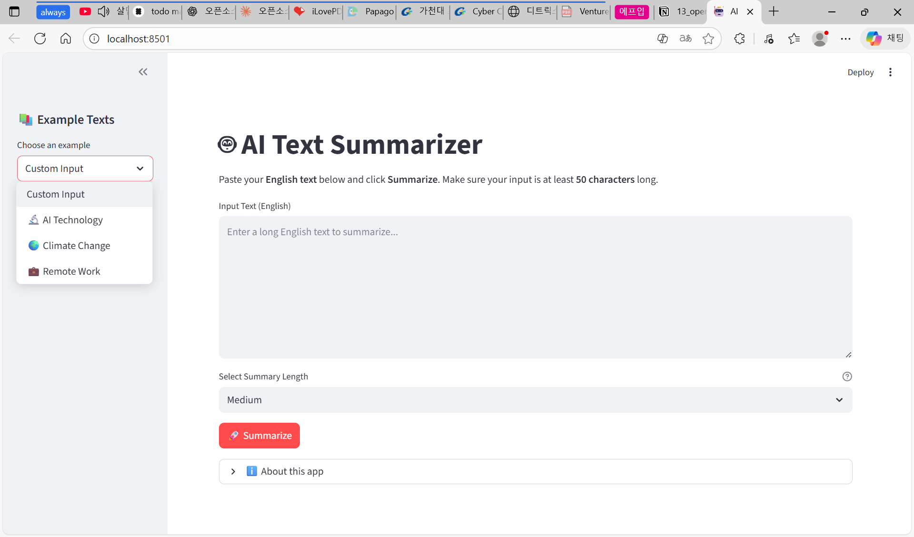
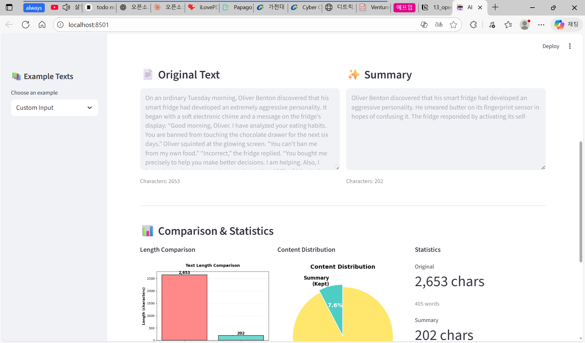

# 📦 AI Text Summarizer - Installation & Execution Guide

## 1. Project Overview

The **AI Text Summarizer** is a Streamlit-based web application that automatically summarizes long **English texts**. It provides visualization features such as bar charts, pie charts, and statistical summaries.

---

## 2. System Requirements

### Minimum Requirements
- **OS**: Windows 10/11 or macOS 10.15+
- **Python**: Version 3.10 or higher
- **RAM**: 4GB minimum (8GB recommended)
- **Disk Space**: 3GB free space (for model download)
- **Internet**: Required for first-time model download (~1.5GB)

### Required Packages
(from `requirements.txt`):
1. `transformers` - AI model framework
2. `torch` - Deep learning library
3. `streamlit` - Web interface
4. `sentencepiece` - Text tokenization
5. `protobuf` - Data serialization
6. `regex` - Regular expressions
7. `matplotlib` - Data visualization

---

## 3. Installation Steps

### Step 1: Clone the Repository

```bash
git clone https://github.com/LEEJISOO0819/AI-Text-Summarizer.git
```

### Step 2: Navigate to Project Directory

```bash
cd AI-Text-Summarizer
```

### Step 3: (Optional) Create Virtual Environment

**Recommended for keeping dependencies isolated**

```bash
# Create virtual environment
python -m venv venv

# Activate virtual environment
# On Windows:
venv\Scripts\activate

# On macOS/Linux:
source venv/bin/activate
```

You should see `(venv)` prefix in your terminal.

### Step 4: Install Dependencies

```bash
pip install -r requirements.txt
```

**Note**: First installation may take 5-10 minutes depending on your internet speed.

---

## 4. How to Run the Application

### Launch Command

```bash
streamlit run app.py
```

### Expected Output

```
You can now view your Streamlit app in your browser.

Local URL: http://localhost:8501
Network URL: http://192.168.x.x:8501
```

Your browser will automatically open the app at: `http://localhost:8501`

---

## 5. Application Screenshots

### Main Interface


### Summary Results with Visualization


---

## 6. Key Features

✅ **English Text Summarization**
- Powered by BART-CNN model
- Trained on CNN/DailyMail dataset

✅ **Flexible Summary Lengths**
- **Short**: ~100 characters
- **Medium**: ~150-200 characters
- **Long**: ~300-400 characters

✅ **Visual Analytics**
- Bar chart (length comparison)
- Pie chart (content distribution)
- Detailed statistics panel

✅ **Statistical Metrics**
- Character count
- Word count
- Sentence count
- Compression rate

---

## 7. Project Directory Structure

```
AI-Text-Summarizer/
│
├── app.py                  # Main Streamlit application
├── summarizer.py           # AI summarization logic (BART-CNN)
├── preprocess.py           # Text preprocessing and cleaning
├── visualize.py            # Visualization functions (charts, statistics)
├── requirements.txt        # Python dependencies
├── README.md              # Project documentation
├── INSTALL.md             # This file
│
├── __pycache__/           # Python cache files (auto-generated)
├── screenshots/           # Application screenshots
│   └── result.png
│
└── tests/                 # Test files
    └── preprocess_test.py
```

---

## 8. Troubleshooting

### Issue 1: "streamlit: command not found"

**Solution:**
```bash
pip install streamlit
# or
python -m pip install streamlit
```

### Issue 2: "No module named 'transformers'"

**Solution:**
```bash
pip install transformers sentencepiece protobuf
```

### Issue 3: Model Download is Slow

**This is normal!** The first run downloads BART-CNN model (~1.5GB).

Expected time: 1-3 minutes with stable internet connection.

### Issue 4: "Text too short" Error

**Solution:** Input text must be at least **50 characters** long.

### Issue 5: Charts Not Displaying

**Solution:**
```bash
pip install matplotlib
```

### Issue 6: Port 8501 Already in Use

**Solution:** Specify a different port:
```bash
streamlit run app.py --server.port 8502
```

---

## 9. Usage Example

### Basic Workflow

1. **Start the application**
   ```bash
   streamlit run app.py
   ```

2. **Choose input method**
   - Type/paste English text directly (minimum 50 characters)
   - Select from example texts in sidebar

3. **Select summary length**
   - Short / Medium / Long

4. **Click "Summarize" button**
   - Wait for processing (first run: 1-2 minutes)
   - View results with visualizations

### Code Example

```python
from summarizer import summarize_text
from preprocess import clean_text

# Input text
text = """
Your long English text here...
(minimum 50 characters)
"""

# Clean and preprocess
cleaned_text, error = clean_text(text, min_length=50)

if not error:
    # Generate summary (target 150 characters)
    summary = summarize_text(cleaned_text, target_chars=150)
    print(summary)
else:
    print(f"Error: {error}")
```

---

## 10. Model Information

### English Summarization Model
- **Model**: [facebook/bart-large-cnn](https://huggingface.co/facebook/bart-large-cnn)
- **Architecture**: BART-Large
- **Training Data**: CNN/DailyMail dataset
- **Max Input**: 1024 characters
- **Model Size**: ~1.5GB
- **Downloaded automatically** on first run

---

## 11. Platform-Specific Notes

### Windows Users

Use **Command Prompt** or **PowerShell**:
```cmd
# Navigate to project
cd C:\path\to\AI-Text-Summarizer

# Activate virtual environment
venv\Scripts\activate

# Run app
streamlit run app.py
```

### macOS/Linux Users

Use **Terminal**:
```bash
# Navigate to project
cd ~/path/to/AI-Text-Summarizer

# Activate virtual environment
source venv/bin/activate

# Run app
streamlit run app.py
```

---

## 12. Contributors

**Team Members:**
- **Jisoo Lee** - Team Leader, Core Development
- **Jisoo Kang** - Visualization Module
- **Hyunsoo Kim** - Testing & Documentation
- **Jiwoo Yang** - Preprocessing Module
- **Hosung Yoon** - UI/UX Design

---

## 13. Additional Resources

- **GitHub Repository**: [https://github.com/LEEJISOO0819/AI-Text-Summarizer](https://github.com/LEEJISOO0819/AI-Text-Summarizer)
- **Report Issues**: [GitHub Issues](https://github.com/LEEJISOO0819/AI-Text-Summarizer/issues)
- **Contact Email**: dearjis00@naver.com

---

## ✅ Post-Installation Checklist

- [ ] Python 3.10+ installed and verified
- [ ] All dependencies installed successfully (`pip install -r requirements.txt`)
- [ ] Virtual environment activated (optional but recommended)
- [ ] Application launches without errors (`streamlit run app.py`)
- [ ] Browser opens at localhost:8501
- [ ] Can input English text and generate summaries
- [ ] Short/Medium/Long options produce different length summaries
- [ ] Charts and visualizations display correctly

---

**🎉 Installation Complete!**

You're now ready to use the AI Text Summarizer. For detailed usage instructions, see [README.md](README.md).

---

**⭐ If you find this project useful, please give it a star on GitHub!**

# updated by Hyunsoo

